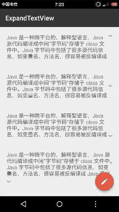

## 支持展开的TextView----ExpandTextView

参考开源项目[ExpendableTextView](https://github.com/Manabu-GT/ExpandableTextView)，
 原项目使用LinearLayout包装TextView和Button的做法，需要保证id的一致，文本内容需要在代码中设置，操作较为复杂，笔者的做法则更加简单简洁一些,
 直接继承自TextView，保留TextView完整特性，且简化了操作，核心思想就是动态的设定TextView的padding值。
 本控件解决了不同分辨率下适配的问题,增加了一些新的属性，优化了像setMaxLine()/setMaxHeight()会导致的多次requestLayout的问题，解决了在列表控件中使用会出现的展开/折叠错位的问题。
 同样也良好的支持了列表控件，RecyclerView,ScrollView,AbsListView等。

### Demo演示
[下载Demo](art/app-debug.apk)



### 属性
- maxCollapsedLines 设置开始折叠的行数
- animDuration 展开/折叠动画时长
- animAlphaStart  透明度渐变起始值
- expandDrawable  指示展开状态的图标
- collapseDrawable 指示折叠状态的图标
- **arrowAlign** 指示状态的图标的对齐方式,有左/上,居中,右/下可选
- **arrowPosition** 指示状态的图标位置,两种可选,在text的右边和在text的下面
- **arrowPadding** 可以设置图标离文字的间距

### 使用
### 添加gradle依赖
```
compile 'com.lcodecorex:extextview:1.0.2'
```

### layout文件中添加配置
```xml
<com.lcodecore.extextview.ExpandTextView
            android:layout_width="wrap_content"
            android:layout_height="wrap_content"
            android:padding="20dp"
            android:text="@string/test"
            android:textColor="#666666"
            android:textSize="16sp"
            app:arrowAlign="center"
            app:arrowPadding="8dp"
            app:arrowPosition="below"
            app:maxCollapsedLines="4" />
```

其它按TextView的使用方法使用即可。

### 事件监听
et.setOnExpandStateChangeListener() 可以监听展开和折叠状态的变化。
```java
void onChangeStateStart(boolean willExpanded);
void onExpandStateChanged(TextView textView, boolean isExpanded);
```

### 更新日志
#### v1.02
- 修复在列表控件中滚动的高度计算问题
- 去除多余的依赖
- 解决展开/折叠在列表控件中使用的错位问题
- 性能优化，减少了requestLayout的次数

#### v1.01
- 解决不同分辨率的适配问题
- 支持个性化展开图标
